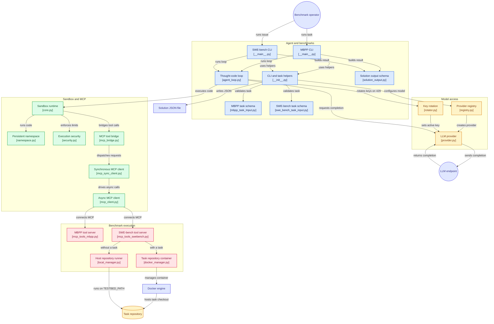

*This project has been created as part of the 42 curriculum by mobenais, bclairot.*

# Agent Smith

## Table of Contents

- [Description](#description)
- [Instructions](#instructions)
- [Resources](#resources)
- [System Architecture](#system-architecture)
- [Agent Loop](#agent-loop)
- [Sandbox Design](#sandbox-design)
- [Tool Implementation Details](#tool-implementation-details)
- [Benchmark Results and Analysis](#benchmark-results-and-analysis)

## Description

Agent Smith is an autonomous coding agent, built and evaluated against two benchmarks:

- **MBPP** (Mostly Basic Python Problems) — small, self-contained Python programming
  exercises validated by a test suite.
- **SWE-bench** — real GitHub issues from real open-source repositories, evaluated
  inside the project's own Docker environment.

The agent runs a **Thought → Code → Observation** loop: an LLM writes a block of
Python code, that code executes inside an isolated **sandbox**, and the result is
fed back to the LLM as the next observation. The sandbox exposes a set of tools
(reading/editing files, searching code, running tests, etc.) as ordinary Python
functions, without the agent's prompt or code ever hardcoding what those tools are
— they are discovered dynamically from whichever **MCP (Model Context Protocol)**
server is connected, so the system works against an MCP server it has never seen
before.

The project is split into two independent halves behind one interface contract:

- **Agent side** (mobenais) — the LLM providers, code extraction, the
  Thought/Code/Observation loop, the benchmark CLIs.
- **Execution side** (bclairot) — the sandbox (security, isolation, the
  `final_answer()` mechanism), the MCP client, and the MCP tool servers for both
  benchmarks (including the Docker bridge for SWE-bench).

## Instructions

### Install

```bash
make install        # uv sync, then copies .env.example to .env if .env does not exist yet
```

or manually:

```bash
uv sync
cp .env.example .env
```

`.env` at the repository root holds:

```bash
GROQ_API_KEY=
GEMINI_API_KEY=
MISTRAL_API_KEY=
TESTBED_PATH=
```

Fill in your LLM provider API key(s) (see [Agent Loop](#agent-loop) below for which
environment variables are read). Leave `TESTBED_PATH` empty for the agents: it is the
repository path **inside the SWE-bench container** and defaults to `/testbed` (see
[`TESTBED_PATH`](#testbed_path)).

### Run the sandbox on its own (no LLM)

```bash
uv run sandbox                                              # bare REPL, no MCP server
uv run sandbox sandbox_template.json                        # with a config file
uv run sandbox --mcp-stdio "python mcp_tools_mbpp.py"       # connect an MCP server over stdio
uv run sandbox --mcp-server http://localhost:8080/mcp       # connect one over HTTP
TESTBED_PATH=/path/to/repo uv run sandbox --mcp-stdio "python mcp_tools_swebench.py"
                                                            # SWE-bench tools on a local checkout
```

Each line typed is executed and remembered across the session (variables persist,
the same way the agent's code blocks do). `exit` or Ctrl+D to leave.

### Run an MCP tool server on its own

```bash
uv run python mcp_tools_mbpp.py --task-file cache/mbpp_task.json
TESTBED_PATH=/testbed uv run python mcp_tools_swebench.py --task-file cache/swebench_task.json
TESTBED_PATH=/path/to/repo uv run python mcp_tools_swebench.py     # isolation mode, no task
```

Both support `--http --host --port` for streamable HTTP instead of stdio. The
SWE-bench server reads the repository location from the **`TESTBED_PATH`**
environment variable and has two modes:

- **with `--task-file`**: it starts the task's Docker image and runs every tool inside
  that container, where the repository is at `TESTBED_PATH` (`/testbed`);
- **without a task**: it runs the tools directly on the host checkout at
  `TESTBED_PATH` — the way the moulinette tests the tools in isolation (subject V.4).
  `run_tests()` then answers that there is no `eval_script` to run.

### Run the agent loop

The two subject CLIs live in `agent/agent_mbpp` and `agent/agent_swebench`; the helpers they
share (argument parsing, task loading, first prompt, configuration) are in `agent/__init__.py`.

```bash
uv run python -m agent_mbpp --task-file cache/mbpp_task.json --output solution.json \
    --model-name qwen/qwen3.8-27b [--provider-url https://api.groq.com/openai/v1]
uv run python -m agent_swebench --task-file cache/swebench_task.json --output solution.json \
    --model-name qwen/qwen3.8-27b
make run_mbpp / make run_sw-bench           # same, with the files of cache/
```

`--provider-url` takes the provider's base URL, as in the subject (`/chat/completions` is
appended when it is missing); a full `.../chat/completions` URL works too.

By default each CLI starts its own MCP server over stdio (`mcp_tools_mbpp.py` or
`mcp_tools_swebench.py`, with `--task-file`). Another server can be used instead:

```bash
... --mcp-server http://localhost:8080/mcp     # streamable HTTP
... --mcp-stdio "python my_server.py"          # stdio
```

Which models exist, and at which endpoint, is configuration rather than code:
**`models.json`** at the repository root lists one URL and one model list per provider,
and `schemas/models_config.py` validates it with Pydantic and builds the providers from
it. Adding a provider is a JSON edit — the key variables follow from its name
(`groq` -> `GROQ_API_KEY` / `GROQ_API_KEYS`), and nothing in the registry or the agent
loop names a provider. The file is rejected at startup with an explicit message if it is
missing or not valid JSON, a provider has a URL but no model, a model is served twice, or a
list is empty.

API keys themselves never appear in it: they come only from the environment (`.env`),
as `GROQ_API_KEY`, `GEMINI_API_KEY`, `MISTRAL_API_KEY`, or their plural form
`GROQ_API_KEYS` etc., which is read first. Either accepts several comma-separated keys,
rotated on a 429. `uv run -m src [edit|lcs|puzzle]`
runs demo tasks with wider limits. `NO_FALLBACK=1` keeps a run on a single model (benchmark mode).

### Run the exam scripts

`exam_mbpp.sh`/`exam_swebench.sh`/`exam_sandbox.sh` are provided by the evaluation
harness (not part of this repository) and invoked as:

```bash
./exam_TYPE.sh --student-path ./student --moulinette-path ./moulinette --env-file /path/to/.env
```

## Resources

- [Sandbox design](https://www.youtube.com/watch?v=sL_syMmRkoU)
- [`multiprocessing`](https://docs.python.org/3/library/multiprocessing.html) —
  process isolation and IPC for the sandbox
- [`pickle`](https://docs.python.org/3/library/pickle.html) /
  [`dill`](https://pypi.org/project/dill/) — namespace persistence between
  `execute()` calls
- [Model Context Protocol](https://modelcontextprotocol.io/) — the tool/resource/
  prompt protocol the sandbox speaks to the MCP servers
- [SWE-bench](https://www.swebench.com/) — the benchmark and its harness
  (`swebench` package, used by the moulinette's `swebench/interact.py`)

### AI usage

On the **execution side (bclairot)**, an AI coding assistant was used to explain
concepts (MCP, an asyncio loop running in a thread, `multiprocessing` IPC, Docker exec) from which
the core of the sandbox, the MCP client and the tool servers was written by hand; to write the
docstrings; and, after a review of the project against the subject.
It also drafted this README. Every change was reviewed and committed by bclairot.

On the **agent side (mobenais)**, an AI coding assistant was used to review and
refactor code (extraction, shared CLI helpers, English naming, flake8), to check
which free-tier models answer with real API calls, to write the benchmark scripts and simulations
of provider failures, and to draft the benchmark report from the measured data.

## System Architecture


*Mermaid diagram done with [GitDiagram](https://gitdiagram.com)*

The two sides only ever talk to each other through `Sandbox.execute()`,
`Sandbox.get_manual()`, and `Sandbox.close()` — the agent loop never knows which
MCP server is connected or what tools it exposes; the sandbox's manual (fed into
the LLM's system prompt) is generated dynamically from the connected server's
`list_tools()` at runtime.

## Agent Loop

`AgentLoop.run(task_id, benchmark, user_prompt)` (`src/agent_loop.py`) drives the
Thought -> Code -> Observation loop until `final_answer()` or a limit:

1. **Prompt.** The system prompt (`schemas/tools/prompts.py`, one for MBPP, one for SWE-bench)
   is followed by the sandbox manual from `sandbox.get_manual()`, so the tool list always comes
   from the connected MCP server, even an unknown one. `compact_manual` keeps every tool
   signature and shortens only the long `[...]` allowlists inside the limits section — the bulk
   of it — so what follows them still reaches the model: the allowed directories, the network
   ban and the `final_answer` contract.
2. **History within budget.** `fit_view` sends the task and the last turns intact and shortens
   older observations (`truncate_history`), shrinking the window until the request fits the
   remaining input budget (with a 10 % margin). The limit is checked *before* each request.
3. **Call.** `make_llm(model)` (`llm/registry.py`) builds an `OpenAICompatibleProvider` whose URL
   and key variable come from the model's provider (Groq, Google AI Studio, Mistral). Without
   `--model-name`, `default_model()` picks the first model of `AUTHORIZED_LLM` whose provider
   actually has a key in the environment. Generation stops on `<end_code>` / `</tool_call>` so
   the model cannot invent an observation.
4. **Extraction.** `extract_code` (`schemas/tools/tools_agent.py`) accepts a Python block (the
   primary format), Anthropic XML `<invoke>`, Hermes `<tool_call>` JSON, ReAct
   `Action:/Action Input:`, an unclosed block or code after a bare `Code:`. Non-Python calls are
   converted into Python calls. **Every liberty taken is named back to the model** in a `note`
   prefixed to the observation: a converted call, an unclosed block, a fence with no language
   tag, a ``` inside a string mistaken for the block's end, or an answer holding several blocks
   of which only the last ran. Notes accumulate when several apply to the same block.
5. **Execution.** The code runs in the sandbox; stdout, stderr, errors, timeouts and truncation
   become the next `Observation`. When 2 iterations or 20 % of the input budget remain, the model
   is told to submit. That warning is added to the *copy* of the history sent with the request
   and never stored, so it cannot still be announcing a stale step count several turns later, and
   `sandbox_output` keeps only what the sandbox actually returned.
6. **Provider failures.** On 429 the next API key of the same provider is used (`TokenRotator`).
   On 404/408/413/429/500/502/503/504 or a network error with no key left, the loop switches to the next model
   of `AUTHORIZED_LLM` (Groq, then Gemini, then Mistral, strongest first); the new model keeps the
   whole history plus a handover note (`create_newcontext`). If every model failed, it waits 60 s
   and tries a full round again before giving up. A 413 first shrinks the history.
7. **Stop.** `final_answer`, or a limit (iterations, input/output tokens, wall time measured from
   process start with a 10 s margin to write `solution.json`). Every stop condition is an
   `AgentLoopError`, turned into `SolutionOutput(success=False, error=...)` instead of a crash.
   If the agent did not submit, the CLI keeps the last code (MBPP) or the container's `get_patch()`
   (SWE-bench).

Every step is recorded as a `StepMetrics` (`llm_output`, `sandbox_input`, `sandbox_output`,
tokens, time, retries, model and URL used), and the run is returned as a `SolutionOutput`: this
is the trace the evaluator inspects to check that the task was solved through real tool use.

## Sandbox Design

`src/sandbox/` (`core.py`, `security.py`, `namespace.py`, `mcp_bridge.py`, `cli.py`)
implements `class Sandbox`, satisfying the shared `SandboxProtocol`:
`execute(code) -> ExecutionResult`, `get_manual() -> str`, `close()`.

**Isolation choice: a fresh `multiprocessing.Process` per `execute()` call**, not
in-process `exec()`. In-process execution makes a hard timeout and memory limit
hard to enforce cleanly (you can't reliably interrupt arbitrary running Python from
outside itself); a real OS process gives a real boundary — `SIGTERM` on timeout, a
hard `RLIMIT_AS`/`RLIMIT_NPROC`/`RLIMIT_NOFILE` via `resource.setrlimit` — at the
cost of having to carry state across calls explicitly. That state (the Python
namespace) is serialized with `dill` (handles closures/functions `pickle` can't)
and restored into the next process, which is how "variables persist between
`execute()` calls" is implemented despite each call being a brand-new process.

**Security layers, all stdlib-only** (no `RestrictedPython` or similar, as
required):
- **Imports** — `_restricted_import` (`security.py`) replaces `__import__` with an
  allowlist check (`SandboxConfig.authorized_imports`, supporting `"pkg.*"`
  wildcards), and strips unauthorized submodules pulled in via `from x import y`.
- **Filesystem** — `_restricted_open` wraps `open()`: normalizes `str`/`bytes`
  paths and resolves them with `os.path.realpath` *before* comparing them against
  `allowed_directories`, so a traversal like `/testbed/../etc/passwd` can't escape
  the allowlist.
- **Network** — `socket.socket` is replaced with a call that always raises, inside
  the worker process only.
- **Builtins** — the child's namespace only exposes an explicit allowlist of
  builtins (`namespace.py`); dangerous ones (`eval`, `exec`, `compile`, `open`,
  `__import__`, `input`, `breakpoint`, `globals`, `help`) are removed or
  overridden.
- **Attributes, checked at parse time** — the code is parsed with `ast` before
  anything runs and rejected if it touches a dunder attribute (the classic
  `().__class__.__bases__[0].__subclasses__()` route) or a frame/code attribute
  (`gi_frame`, `f_back`, `f_globals`, `f_builtins`, `tb_frame`, ...). Walking frames
  out of the `exec` frame is the other classic escape: it reaches the sandbox's own
  frames, whose builtins are the real, unrestricted ones.
- **Audit hook, the backstop** — the checks above work on names, but an authorized
  module can still hand out a dangerous one as a plain attribute (`typing.sys`, for
  instance, is the real `sys`). So right before the code runs, the worker installs a
  `sys.addaudithook` hook, which cannot be removed afterwards. It sees what the
  interpreter actually does, whatever object the code reached: every `open` (also
  `os.open`, `pathlib`) must stay inside `allowed_directories` (plus the Python
  install, so authorized modules can still be imported), and network
  (`socket.connect`/`bind`/`getaddrinfo`), process spawning (`os.system`,
  `subprocess.Popen`, `os.exec*`, `os.posix_spawn`) and `ctypes` events are refused.
- **Timeout / memory** — enforced by the parent (`p.join(timeout=...)`, then
  `terminate()`/`kill()`) and by `resource.setrlimit(RLIMIT_AS, ...)` inside the
  child, respectively.
- **`KeyboardInterrupt`/`SystemExit`** — the worker only catches `Exception`, never
  these two. A real Ctrl+C reaches the parent directly (same process group): the
  agent loop saves a backup and stops, and the CLI still closes the sandbox and the
  MCP server. If generated code raises one itself, only the worker dies and the
  observation reports that the sandbox process died, so the model cannot shut the
  agent down.

**`final_answer(value)`** is injected into every sandbox namespace regardless of
which MCP server is connected — it is *not* an MCP tool. It works by raising an
internal `_FinalAnswer` exception that `execute()` catches and turns into
`ExecutionResult.final_answer`.

**MCP bridge** (`mcp_bridge.py`): the MCP client (`src/mcp_client.py`,
`src/mcp_sync_client.py`) and its event loop live in the **parent** process, never
in the sandboxed child — tool calls cross a `Queue` to a bridge thread in the
parent, which is why MCP tool actions are *not* subject to the sandbox's own
timeout (a tool like `run_command` can legitimately take longer than the code that
called it). Each request/response pair is tagged with a `generation_nb` so a
response arriving after its child was already killed on timeout can't be
misrouted into the next call. Every tool from the connected server becomes a
Python function in the sandbox namespace via `_make_tool_proxy`, with no tool name
ever hardcoded — connecting a different MCP server changes the available
functions and the generated manual (`get_manual()`) automatically.

## Tool Implementation Details

### MBPP (`mcp_tools_mbpp.py`)

One mandatory tool, `run_tests(code, test_list=None)`: runs the candidate solution
against each assertion, one after the other, in a separate `multiprocessing.Process`
(same isolation rationale as the sandbox itself), under a wall-clock timeout via `SIGTERM`, and
returns `{"success": bool, "output": str}` as JSON — `output` holds the first
failing assertion plus captured stdout/stderr, truncated with an explicit notice
past `max_std_length`. A `check_syntax(code)` tool is included as an extra, so the
agent can catch a `SyntaxError` before spending an iteration on a failed test run.

### SWE-bench (`mcp_tools_swebench.py` + `src/docker_manager.py` / `src/local_manager.py`)

All 9 mandatory tools run against the repository through one of two backends with
the same interface (`exec`, `replace_file`, `workdir`, `cleanup`), so the tools
themselves don't know which one is behind them:

- **`DockerManager`** (a task is given): one long-lived container per server
  instance, started from the task's `docker_image`
  (`containers.run(image, command="tail -f /dev/null", detach=True, init=True)`),
  so state — file edits, git history — persists across the whole task the same way
  it would inside a real terminal session.
- **`LocalManager`** (no task): the commands run with `subprocess` directly on the
  host checkout at `TESTBED_PATH`. This is the mode the moulinette uses to test the
  tools in isolation; `run_tests()` then returns an explicit message, since there is
  no `eval_script`.

The tools:

- **Filesystem**: `read_file`/`edit_file`/`list_files`. `read_file` mirrors
  `cat -n`. `edit_file` requires `old_str` to occur in the file exactly once
  (counted in Python on the raw file content, not a regex substitution), and
  writes back through the backend's `replace_file` — `container.put_archive` (a tar
  archive over the Docker API) or a plain file write on the host — not a shell
  command, since arbitrary source code routinely contains characters that break
  naive shell quoting. When the edited file is Python and no longer
  parses, the edit is kept but the answer says so, with the error and its line
  (subject V.1: an edit that introduced a syntax error must be reported).
- **Search**: `search_code`/`search_function_or_class_definition_in_code`/
  `find_references`, all `grep`-based, run from the repository root so paths come
  out absolute, exclude `.git/` and binary files, and reformat grep's
  `path:line:content` into the subject's required `path:line content`.
  `find_references` searches the whole repository and excludes only the exact
  `file:line` of the definition site, not just any line sharing that number.
- **Execution**: `run_tests()` runs the task's `eval_script` (its literal bash
  content, not a path to it); `get_patch()` is exactly
  `git -c core.fileMode=false diff` (the `-c core.fileMode=false` avoids
  Docker-induced file-permission noise polluting the diff); `run_command(command,
  workdir)` returns stdout, stderr and exit code together.
- Every command runs as `timeout {N}s bash -c "<command>"` — a relative `workdir`
  (including the implicit default) is resolved against the repository root before
  being sent to Docker, which otherwise rejects a relative working directory
  outright.
- Every argument that ends up in a shell command (file paths, directories, search
  patterns, symbol names) goes through `shlex.quote`, so a pattern such as `it's`
  or `x; rm -rf /` is searched for literally instead of breaking or extending the
  command. `run_command` is the only tool whose argument is meant to be a shell
  command.
- The repository root itself is read from the **`TESTBED_PATH`** environment
  variable (set by the moulinette before the server starts, per the subject), not
  guessed from the Docker image.
- `cleanup()` removes the container with `remove(force=True)`: one fast API call
  that kills and removes it together. A graceful `stop()` would wait ~10 s, because
  `tail` running as PID 1 ignores `SIGTERM`. When the MCP client closes, the SDK
  leaves the server about 2 s before `SIGTERM` and 2 s more before `SIGKILL`, so a
  `stop()` followed by `remove()` would be killed half-way, leaving a stopped
  container behind. `cleanup()` is idempotent and wired to `SIGTERM`/`SIGINT`, so it
  runs on a clean exit, on the client's shutdown and when the evaluator force-kills
  the process on timeout.

#### `TESTBED_PATH`

`TESTBED_PATH` is the absolute path of the repository: **inside the container**
(`/testbed` in every SWE-bench image) when the server has a task, or **on the host**
in isolation mode. It is unrelated to `--mcp-server`, which is only the transport used
to reach the tool server; by default neither CLI uses a URL at all, since both start
their server over stdio. What `TESTBED_PATH` actually drives, in both backends:

- it is the default working directory of every command run in the container, so
  `run_tests()` and `run_command("pytest ...")` start at the repository root rather
  than at `/`;
- a relative `workdir` is resolved against it before reaching Docker, whose exec API
  rejects a relative working directory outright;
- a relative file path is resolved against it too, which is what lets the agent write
  `read_file("xarray/core/merge.py")` instead of the full absolute path.

**Crossing the stdio boundary.** By default `mcp.stdio_client` passes the child
process only a fixed allowlist of variables — `HOME`, `LOGNAME`, `PATH`, `SHELL`,
`TERM`, `USER` on POSIX (`DEFAULT_INHERITED_ENV_VARS`) — which would drop
`TESTBED_PATH`. `MCPClient.build_client()` therefore passes the whole environment
(`env=dict(os.environ)`) to `StdioServerParameters`, so exporting `TESTBED_PATH` in
the shell is enough for `uv run sandbox --mcp-stdio "python mcp_tools_swebench.py"`.

`agent_swebench` also sets it explicitly in the command it builds, from the
environment or `/testbed` by default:

```bash
env TESTBED_PATH=/testbed python mcp_tools_swebench.py --task-file <task>.json
```

The value in the command takes precedence over the inherited one, so the agent works
whether the variable is exported, empty in `.env`, or absent. A server started
directly, or over HTTP, just reads it from its own environment.

## Benchmark Results and Analysis

Full data, tables and analysis: [`BENCHMARK_REPORT.md`](BENCHMARK_REPORT.md); raw runs and
their `solution.json` in `BENCHMARK/`.

- **Grid:** 5 free-tier models (qwen3.8-27b and gpt-oss-120b on Groq; gemini-3.5-flash,
  3.5-flash-lite and 3.6-flash on Google AI Studio) x 3 SWE-bench Verified tasks
  (`sympy-14711`, `sympy-13480`, `pydata__xarray-4629`), one model per run, validated with the
  moulinette. Only 3 of the 5 models have real data: `gemini-3.5-flash` and `3.6-flash` never
  finished a run (quota), and are kept in the tables to document that.
- **Best model:** `qwen/qwen3.8-27b`, 7 / 7 PASS over v1, v2 and v3, fast and quick to find the
  right file; it is first in the fallback order.
- **Coverage:** these 3 tasks are 3 of the 6 in the exam pool; the other 3 are planned for v4
  (see the report).
- **Main limit is quota, not reasoning:** most failed cells are "provider unavailable". Groq is
  limited per minute (hundreds of 429 absorbed by key rotation and waits); Gemini keys of one
  project share a daily quota that `gemini-3.5-flash` and `3.6-flash` always exhausted.
- **Ablation (system prompt):** on 5 MBPP tasks, the explicit prompt (test before submitting,
  fix only what the failing assertion shows, worked example) takes `codestral-2508` from 1/5 to
  5/5; for qwen both reach 5/5 but the explicit prompt needs fewer iterations.
